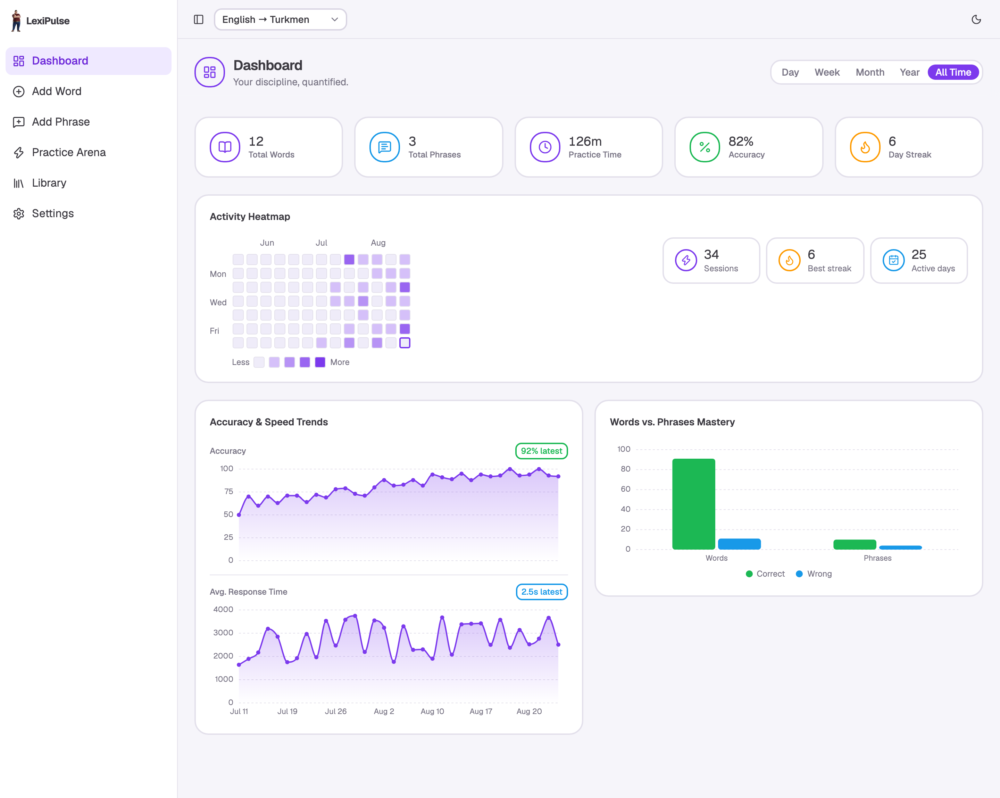
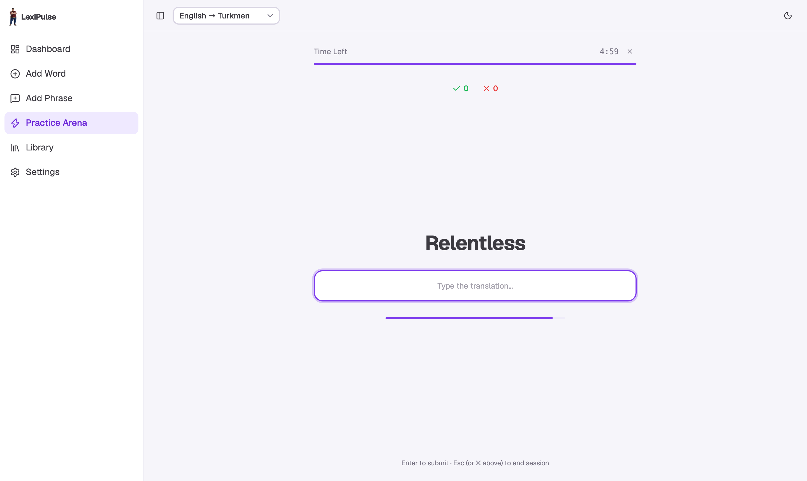
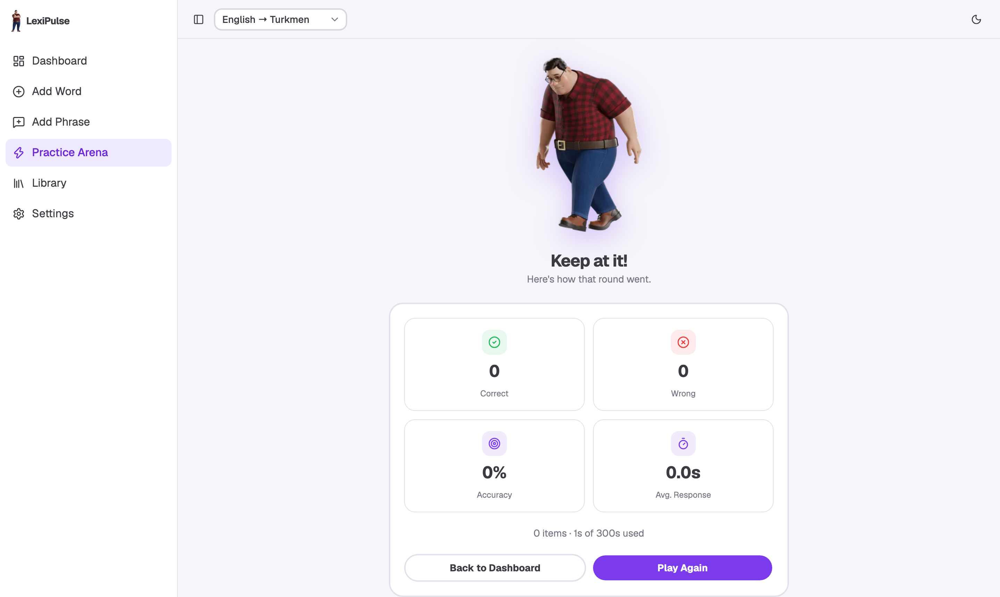
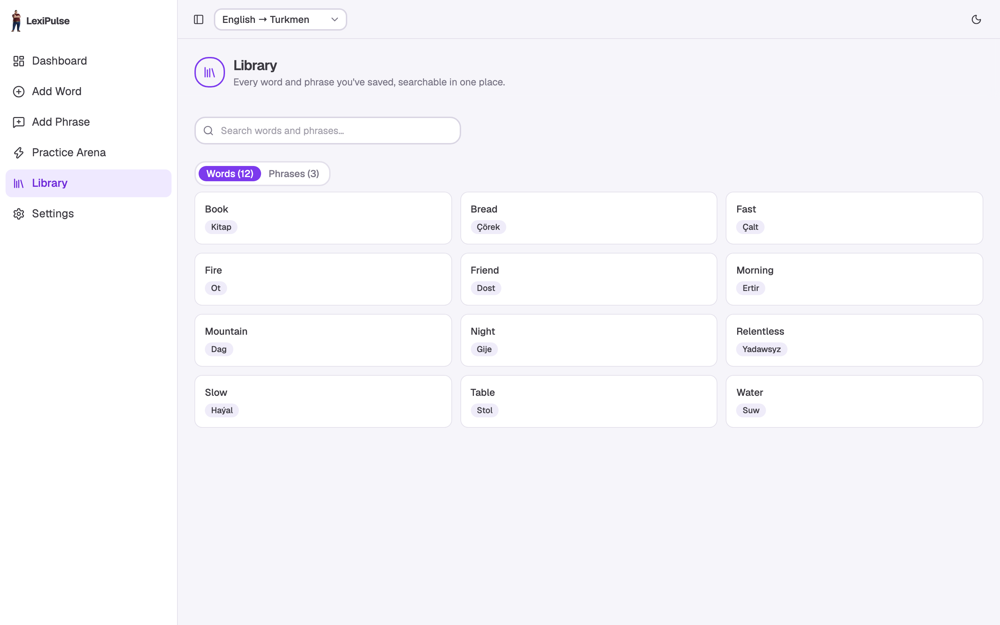
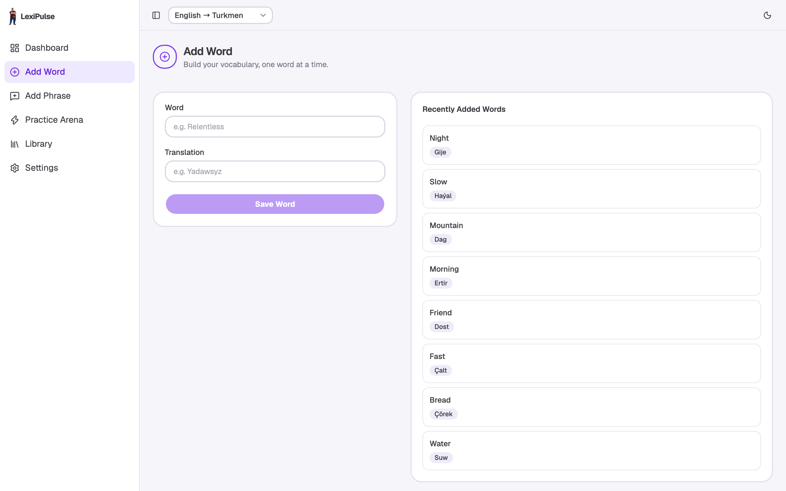
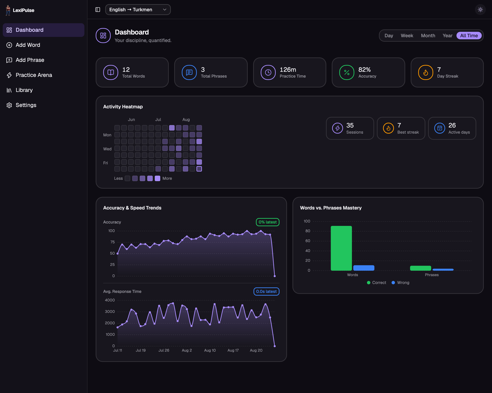
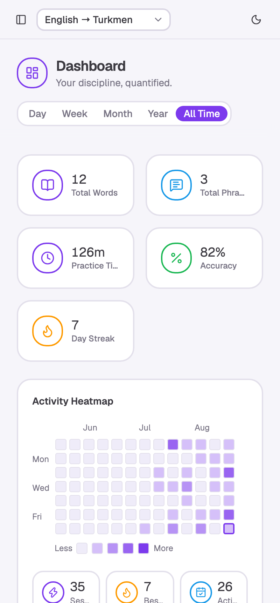

<div align="center">


# LexiPulse

**Learn vocabulary the way you'll actually use it — under time pressure.**

A local-first vocabulary and phrase trainer that pairs active recall with
time-pressured typing practice, then shows you exactly how your accuracy and
speed are moving. No account, no backend, no network. Your data never leaves
your device.

[](https://github.com/HRuler19/Lingo-reflex/actions/workflows/ci.yml)
&nbsp;
&nbsp;
&nbsp;

[**Download**](#download) &nbsp;·&nbsp; [Features](#features) &nbsp;·&nbsp; [Screenshots](#screenshots) &nbsp;·&nbsp; [Development](#development) &nbsp;·&nbsp; [Architecture](#architecture)



</div>

---

## Why LexiPulse

Most flashcard apps let you *recognise* a word. Recognition is not recall — you
can nod along to a word you'd never produce in conversation.

LexiPulse only accepts **typed answers**, under a **per-item countdown**. You
either produce the word in a few seconds or you don't, and the app records which.
Over time the Dashboard turns that into something honest: accuracy trending up,
response time trending down, and a heatmap showing whether you actually showed up.

It runs entirely on your machine — a single static bundle plus IndexedDB. That
means it works on a plane, costs nothing to host, and there's no account to
create or data to leak.

---

## Download

Prebuilt apps are attached to every [**GitHub Release**](https://github.com/HRuler19/Lingo-reflex/releases/latest).

| Platform | File | Notes |
|---|---|---|
| **macOS** (Apple Silicon) | `LexiPulse-*-arm64.dmg` | Unsigned — see [first launch](#first-launch-on-macos) |
| **macOS** (Intel) | `LexiPulse-*.dmg` | Unsigned — see [first launch](#first-launch-on-macos) |
| **Windows** | `LexiPulse Setup *.exe` | SmartScreen may warn on first run |
| **Linux** | `LexiPulse-*.AppImage` | `chmod +x` then run |
| **Android** | `LexiPulse-*.apk` | Sideload — see [installing on Android](#installing-on-android) |
| **iPhone / iPad** | — | Install as a PWA — see [iOS](#ios) |

#### Installing on Android

The APK is debug-signed rather than Play-Store-signed, so Android treats it as
coming from an unknown source. Download it, tap it, and allow installation when
prompted (*Settings → Apps → Special access → Install unknown apps*).

#### iOS

**There is no downloadable iOS build, and there cannot be one.** Apple only
permits installation through the App Store, TestFlight, or a build signed
against specific registered device UDIDs — an `.ipa` attached to a release page
is not installable by anyone who downloads it. Publishing properly needs a paid
Apple Developer account.

In the meantime the PWA is a genuine substitute on iOS: open the site in Safari
→ **Share** → **Add to Home Screen**. It gets its own icon, launches without
browser chrome, and works fully offline — the app never needed a network anyway.

The native iOS project is still in the repo and builds fine locally
(`npm run ios:open`) if you have Xcode.

#### First launch on macOS

The desktop builds aren't notarized (that needs a paid Apple Developer account),
so Gatekeeper blocks them by default. Right-click the app → **Open** → **Open**,
or run once:

```bash
xattr -dr com.apple.quarantine /Applications/LexiPulse.app
```

---

## Features

| | |
|---|---|
| ⌨️ **Type-to-answer practice** | Recall, not recognition. Session timer plus a per-item countdown; wrong answers shake and let you retry until the clock runs out. |
| 🔀 **Six practice modes** | Words only, phrases only, or hybrid — each in source→target, target→source, or **mixed**, which randomises direction per item. |
| 📊 **Honest analytics** | Accuracy and response-time trends per session, a 13-week activity heatmap with streaks, and words-vs-phrases mastery. |
| 🌍 **Any language pair** | Not hardcoded to one language. Add as many pairs as you like; everything is scoped per pair. |
| 📚 **Searchable library** | Every word and phrase, with multiple accepted translations each, editable inline. |
| 💾 **Real data portability** | Full JSON backup, or CSV for moving vocabulary in and out of spreadsheets. Imports merge instead of duplicating. |
| 📴 **Offline-first** | IndexedDB + service worker. No network is ever required, on any platform. |
| 🌗 **Light & dark** | Both fully designed, not an auto-inverted afterthought. |
| ♿ **Accessible** | Keyboard-operable, labelled controls, and every chart ships a screen-reader data table. |

---

## Screenshots

<table>
<tr>
<td width="50%"><p align="center"><em>Practice Arena — type the translation before the timer runs out</em></p></td>
<td width="50%"><p align="center"><em>Session results, scored the moment you finish</em></p></td>
</tr>
<tr>
<td width="50%"><p align="center"><em>Library — search, edit, and manage everything you've saved</em></p></td>
<td width="50%"><p align="center"><em>Adding a word, with duplicate detection</em></p></td>
</tr>
<tr>
<td width="50%"><p align="center"><em>Dark mode</em></p></td>
<td width="50%" align="center"><p align="center"><em>Responsive down to phone widths</em></p></td>
</tr>
</table>

---

## Development

```bash
npm install
npm run dev          # dev server with HMR
npm run build        # typecheck + production build
npm run test         # Vitest, once
npm run test:watch   # ...or in watch mode
npm run lint         # oxlint
```

**Requirements:** Node 22+. Building the iOS app additionally needs Xcode;
Android needs Android Studio.

### Running on other platforms

The web build in `dist/` is the single source of truth for every platform —
none of them fork the app's logic, they just load the same built site in a
different shell.

```bash
# Mobile (Capacitor)
npm run ios:open       # build, sync, open Xcode
npm run android:open   # build, sync, open Android Studio
npm run cap:sync       # rebuild + copy into both native projects

# Desktop (Electron)
npm run electron:dev   # run against the dev server, with reload
npm run electron:pack  # package an unpacked app (fast, for testing)
npm run electron:dist  # build installers (dmg/zip, nsis, AppImage)
```

Both native projects (`ios/`, `android/`) are checked in — they're configuration,
not build output; their own `.gitignore`s exclude the actual artifacts. Icons and
splash screens for both are generated from `assets/` via
`npx capacitor-assets generate`.

---

## Architecture

### Stack

| Layer | Choice | Why |
|---|---|---|
| UI | React 19 + TypeScript (`strict`) | — |
| Build | Vite 8 | |
| Styling | Tailwind CSS v4 + shadcn/ui (Base UI) | |
| State | Zustand | Two tiny stores: theme, active language pair |
| Database | Dexie over IndexedDB | Structured, indexed, and genuinely offline |
| Charts | Hand-rolled SVG | See [below](#why-there-is-no-chart-library) |
| Native | Capacitor (mobile), Electron (desktop) | One web build, four platforms |

### Project layout

```
src/
  db/schema.ts               Dexie schema: pairs, words, phrases, sessions
  store/                     Zustand stores (theme, active pair)
  lib/
    practice.ts              Practice pool building, answer checking
    analytics.ts             Dashboard KPI/chart derivation
    csv.ts, backup.ts        JSON + CSV export/import
  hooks/
    use-practice-session.ts  The game loop: timers, scoring, early exit
  components/
    layout/                  App shell (sidebar, header)
    dashboard/               Charts + the SVG chart kit
    practice/                Pre-game config, game screen, results
    library/                 Word/phrase edit dialog
    ui/                      shadcn/ui primitives
  pages/                     One file per route
electron/main.cjs            Desktop main process
ios/, android/               Capacitor native projects
```

### Data model

Everything is scoped to a **language pair** (e.g. English → Turkmen). Words and
phrases each carry a list of accepted translations and a running correct/wrong
count. A finished session is stored as a `GameSession` and rolls its per-item
outcomes back into those counts, which is what feeds the mastery chart.

### Notable decisions

<details>
<summary><strong>Why there is no chart library</strong></summary>

The Dashboard originally used Recharts. It cost **~110KB gzip — about 95% of the
Dashboard bundle** — to draw two area charts and one grouped bar chart.

Those shapes are simple enough to render directly, so they're now hand-written
SVG (`components/dashboard/chart-math.ts` + `chart-parts.tsx`), including a
monotone-cubic curve, gradient fills, hover tooltips with a crosshair, and
"nice number" axis ticks.

```
Dashboard chunk    110KB  ->  6KB gzip
dist total         1.6MB  ->  1.2MB
```

The replacements also added a screen-reader data table per chart, which the
library version never had.
</details>

<details>
<summary><strong>Why HashRouter instead of BrowserRouter</strong></summary>

The app ships as a static SPA across hosts that can't share one server-rewrite
rule: a Capacitor native shell, a packaged Electron app loading `dist/index.html`
over `file://`, and the PWA's offline cache.

A hash route never asks the host to resolve `/practice` as a real path, so the
identical build works everywhere with no per-host routing config.
</details>

<details>
<summary><strong>Timers are wall-clock derived, not decremented</strong></summary>

Both the session and per-item countdowns recompute remaining time from
`Date.now()` on every tick rather than subtracting a second each time. A
throttled or backgrounded tab delays and coalesces `setInterval` callbacks — a
decrementing timer would silently run long and drift out of sync with its
sibling. See `hooks/use-practice-session.ts`.
</details>

<details>
<summary><strong>CSV export is hardened against formula injection</strong></summary>

Exported cells contain free text, including text imported from someone else's
file. A cell starting with `=`, `+`, `-`, or `@` is executed as a formula by
Excel and Sheets, so a shared vocabulary list could smuggle in something that
runs when a *different* user re-exports and opens it. Those cells are prefixed
with a single quote — the standard OWASP mitigation. See `lib/csv.ts`.
</details>

<details>
<summary><strong>Translations are escaped, not just joined</strong></summary>

A word's translation list is packed into one CSV cell delimited by `; `. A
translation legitimately containing a semicolon (`"wait; then go"`) would split
into two on re-import, silently corrupting data. The delimiter is escaped on
write and unescaped on read, with the old unescaped format still parsing
correctly. See `lib/backup.ts`.
</details>

### Testing

60 tests across 7 files, covering the parts where a bug would be silent: date
bucketing and streak logic, practice pool construction, answer matching, CSV
round-tripping (including injection and escaping), the session game loop, chart
tick/curve math, and the error boundary.

```bash
npm run test
```

CI runs lint, tests, and a production build on every push and pull request.

---

## License

[MIT](LICENSE) © Hangeldi Cholukov
